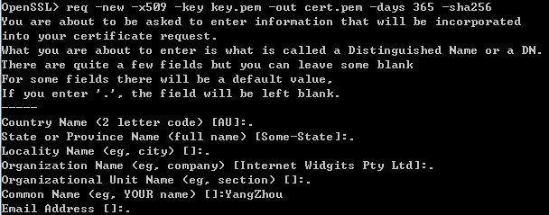
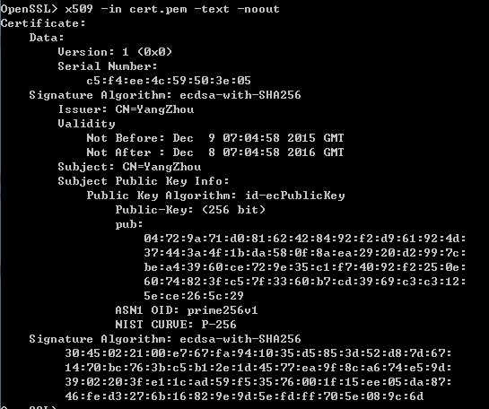

首先，打开openssl，使用命令：
>ecparam -list_curves

查看openssl所支持的椭圆曲线算法：  
  
u2f规范中对签名算法的要求是ECDSA signature(on P-256)，其实就是NIST所规定的secp256r1(注意不是secp256k1)。在openssl中是定义的prime256v1。  
然后输入：
>ecparam -name secp256r1 -genkey -out key.pem

就会生成公私钥文件key.pem。可以通过以下命令查看：
>ec -in key.pem -noout -text

  
私钥32字节，公钥65字节（https://www.ietf.org/rfc/rfc5480.txt，根据这个文献，公钥第一字节0x04表示uncompressed，如果是0x02 or 0x03则表示compressed，u2f要求是uncompressed）

然后就可以开始生成自签名证书：  
>req -new -x509 -key k.pem -out server.pem -days 365 -sha256

**注意，u2f对证书签名时所作hash算法没要求，但是最好是sha256，但是这里命令里的-sha256并没有作用，因为此版本openssl(0.9.8l)还不支持sha256**  
然后会要求输入一堆信息，之后就会生成证书server.pem：
  
查看证书命令：
>x509 -in server.pem -text -noout

  
可以注意到其中签名算法是ecdsa-with-sha1。

**现在问题是，这些证书都是DER编码的。。。怎么转成二进制编码。。。**