###ECC的优势
说 ECC 的优势前，先列举几个 RSA 的劣势：
1. 破解越来越容易。RSA 加密的原理是基于大数运算（2的几千次幂的规模），随着计算机的运算速度越来越快，破解 RSA 的难度逐步降低。目前 1024 位 RSA 密钥已经被认为是不安全的。生产环境使用的 RSA 密钥要求至少是 2048 位。
2. 加密速度比较慢。大数运算很耗计算资源，速度很慢，不适合在嵌入式设备中使用。

ECC 完美解决了以上问题：
1. ECC 基于非常复杂的椭圆曲线算法，数学上被证明是不可破解的——意思就是，即使计算机速度再快，也不可能破解 ECC。
2. 加密速度快。相同密钥强度下，ECC 的加密速度大约是 RSA 的 10 倍，适合在 Secure Element、TrustZone 等一些计算资源比较紧张的环境中使用。

###ECC的公钥和私钥
ECC 的原理非常复杂，所谓的“椭圆”，并不单指我们通常意义上的椭圆，像下面这样的曲线都属于符合 ECC 定义的“椭圆”。  
  
ECC 加解密的原理是在二维平面上找点。要利用 ECC 做加解密，需要：  
1. 确定一个椭圆方程  
并不是所有的椭圆都可以用来加密，诸如 y^2=x^3+a*x+b 这样的椭圆是一类可以用来加密的椭圆。
2. 在这个椭圆上找一个点  
用 G 表示。
3. 确定用于找点的平面范围  
用 p 或 m 指定。

因此，描述一个 ECC 算法，一般用到 6 个常量：p,a,b,G,n,h 或 m,a,b,G,n,h 。如果加入随机因子，再加 1 个常量：S 。 上面这些常量的取值可能有无数种。为了使用方便，SECP 和 IETF 定义了一些组合，并为每种组合取了个名字，如 secp256r1、brainpoolP256r1 等。根据这些曲线名字，我们可以确定 ECC 算法所需要的常量值。其中，G 代表的是二维坐标上的一点，数值上用 x,y 表示。

----
在java card中：<http://www.win.tue.nl/pinpasjc/docs/apis/jc222/javacard/security/ECKey.html>  

----
### 下面是全面易懂地介绍ECC算法的博客文档
<http://blog.csdn.net/sahusoft/article/details/6868016>  
 前言

同RSA（Ron Rivest，Adi Shamir，Len Adleman三位天才的名字）一样，ECC（Elliptic Curves Cryptography，椭圆曲线密码编码学）也属于公开密钥算法。目前，国内详细介绍ECC的公开文献并不多（反正我没有找到）。有一些简介，也是泛泛而谈，看完后依然理解不了ECC的实质（可能我理解力太差）。前些天我从国外网站找到些材料，看完后对ECC似乎懵懂了。于是我想把我对ECC的认识整理一下，与大家分享。当然ECC博大精深，我的认识还很肤浅，文章中错误一定不少，欢迎各路高手批评指正，小弟我洗耳恭听，并及时改正。文章将采用连载的方式，我写好一点就贴出来一点。本文主要侧重理论，代码实现暂不涉及。这就要求你要有一点数学功底。最好你能理解RSA算法，对公开密钥算法有一个了解。《近世代数基础》《初等数论》之类的书，最好您先翻一下，这对您理解本文是有帮助的。别怕，我尽量会把语言通俗些，希望本文能成为学习ECC的敲门砖。

一、从平行线谈起。

平行线，永不相交。没有人怀疑把：）不过到了近代这个结论遭到了质疑。平行线会不会在很远很远的地方相交了？事实上没有人见到过。所以“平行线，永不相交”只是假设（大家想想初中学习的平行公理，是没有证明的）。既然可以假设平行线永不相交，也可以假设平行线在很远很远的地方相交了。即平行线相交于无穷远点P∞（请大家闭上眼睛，想象一下那个无穷远点P∞，P∞是不是很虚幻，其实与其说数学锻炼人的抽象能力，还不如说是锻炼人的想象力）。给个图帮助理解一下：

直线上出现P∞点，所带来的好处是所有的直线都相交了，且只有一个交点。这就把直线的平行与相交统一了。为与无穷远点相区别把原来平面上的点叫做平常点。

以下是无穷远点的几个性质。

▲直线L上的无穷远点只能有一个。  
（从定义可直接得出）  
▲平面上一组相互平行的直线有公共的无穷远点。  
（从定义可直接得出）  
▲ 平面上任何相交的两直线L1,L2有不同的无穷远点。  
（否则L1和L2有公共的无穷远点P ，则L1和L2有两个交点A、P，故假设错误。）  
▲平面上全体无穷远点构成一条无穷远直线。（自己想象一下这条直线吧）  
▲平面上全体无穷远点与全体平常点构成射影平面。  

二、射影平面坐标系

射影平面坐标系是对普通平面直角坐标系（就是我们初中学到的那个笛卡儿平面直角坐标系）的扩展。我们知道普通平面直角坐标系没有为无穷远点设计坐标，不能表示无穷远点。为了表示无穷远点，产生了射影平面坐标系，当然射影平面坐标系同样能很好的表示旧有的平常点（数学也是“向下兼容”的）。

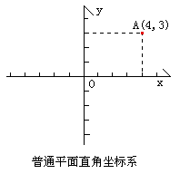

我们对普通平面直角坐标系上的点A的坐标（x,y）做如下改造：
令x=X/Z ，y=Y/Z（Z≠0）；则A点可以表示为（X:Y:Z）。
变成了有三个参量的坐标点，这就对平面上的点建立了一个新的坐标体系。

例2.1：求点（1,2）在新的坐标体系下的坐标。
解：∵X/Z=1 ，Y/Z=2（Z≠0）∴X=Z，Y=2Z ∴坐标为（Z:2Z:Z），Z≠0。即（1:2:1）（2:4:2）（1.2:2.4:1.2）等形如（Z:2Z:Z），Z≠0的坐标，都是（1,2）在新的坐标体系下的坐标。

我们也可以得到直线的方程aX+bY+cZ=0（想想为什么？提示：普通平面直角坐标系下直线一般方程是ax+by+c=0）。新的坐标体系能够表示无穷远点么？那要让我们先想想无穷远点在哪里。根据上一节的知识，我们知道无穷远点是两条平行直线的交点。那么，如何求两条直线的交点坐标？这是初中的知识，就是将两条直线对应的方程联立求解。平行直线的方程是：
aX+bY+c1Z =0； aX+bY+c2Z =0 (c1≠c2)；
（为什么？提示：可以从斜率考虑，因为平行线斜率相同）；

将二方程联立，求解。有c2Z= c1Z= -（aX+bY），∵c1≠c2 ∴Z=0 ∴aX+bY=0；
所以无穷远点就是这种形式（X：Y：0）表示。注意，平常点Z≠0，无穷远点Z=0，因此无穷远直线对应的方程是Z=0。

例2.2：求平行线L1：X+2Y+3Z=0 与L2：X+2Y+Z=0 相交的无穷远点。
解：因为L1∥L2 所以有Z=0， X+2Y=0；所以坐标为（-2Y:Y:0），Y≠0。即（-2:1:0）（-4:2:0）（-2.4:1.2:0）等形如（-2Y:Y:0），Y≠0的坐标，都表示这个无穷远点。

看来这个新的坐标体系能够表示射影平面上所有的点，我们就把这个能够表示射影平面上所有点的坐标体系叫做射影平面坐标系。

练习：
1、求点A(2,4) 在射影平面坐标系下的坐标。
2、求射影平面坐标系下点(4.5:3:0.5)，在普通平面直角坐标系下的坐标。
3、求直线X+Y+Z=0上无穷远点的坐标。
4、判断：直线aX+bY+cZ=0上的无穷远点 和 无穷远直线与直线aX+bY=0的交点，是否是同一个点？

三、椭圆曲线

上一节，我们建立了射影平面坐标系，这一节我们将在这个坐标系下建立椭圆曲线方程。因为我们知道，坐标中的曲线是可以用方程来表示的（比如：单位圆方程是x2+y2=1）。椭圆曲线是曲线，自然椭圆曲线也有方程。

椭圆曲线的定义：
一条椭圆曲线是在射影平面上满足方程
Y2Z+a1XYZ+a3YZ2=X3+a2X2Z+a4XZ2+a6Z3 ----------------[3-1]
的所有点的集合，且曲线上的每个点都是非奇异（或光滑）的。

定义详解：

▲ Y2Z+a1XYZ+a3YZ2 = X3+a2X2Z+a4XZ2+a6Z3是Weierstrass方程（维尔斯特拉斯，Karl Theodor Wilhelm Weierstrass,1815-1897），是一个齐次方程。

▲ 椭圆曲线的形状，并不是椭圆的。只是因为椭圆曲线的描述方程，类似于计算一个椭圆周长的方程（计算椭圆周长的方程，我没有见过，而对椭圆线积分（设密度为1）是求不出来的。谁知道这个方程，请告诉我呀^_^），故得名。

我们来看看椭圆曲线是什么样的。

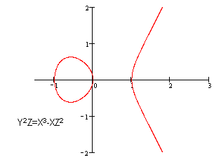  
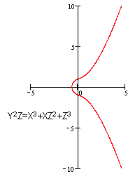

▲ 所谓“非奇异”或“光滑”的，在数学中是指曲线上任意一点的偏导数Fx(x,y,z)，Fy(x,y,z)，Fz(x,y,z)不能同时为0。如果你没有学过高等数学，可以这样理解这个词，即满足方程的任意一点都存在切线。

下面两个方程都不是椭圆曲线，尽管他们是方程[3-1]的形式。

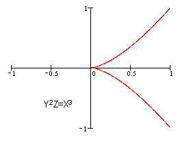 
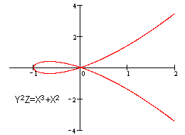 

因为他们在（0:0:1）点处（即原点）没有切线。

▲椭圆曲线上有一个无穷远点O∞（0:1:0），因为这个点满足方程[3-1]。

知道了椭圆曲线上的无穷远点。我们就可以把椭圆曲线放到普通平面直角坐标系上了。因为普通平面直角坐标系只比射影平面坐标系少无穷远点。我们在普通平面直角坐标系上，求出椭圆曲线上所有平常点组成的曲线方程，再加上无穷远点O∞（0:1:0），不就构成椭圆曲线了么？

我们设x=X/Z ，y=Y/Z代入方程[3-1]得到：
y2+a1xy+a3y = x3+a2x2+a4x+a6 -------------------------[3-2]

也就是说满足方程[3-2]的光滑曲线加上一个无穷远点O∞，组成了椭圆曲线。为了方便运算，表述，以及理解，今后论述椭圆曲线将主要使用[3-2]的形式。

本节的最后，我们谈一下求椭圆曲线一点的切线斜率问题。
由椭圆曲线的定义可以知道，椭圆曲线是光滑的，所以椭圆曲线上的平常点都有切线。而切线最重要的一个参数就是斜率k。

例3.1：求椭圆曲线方程y2+a1xy+a3y=x3+a2x2+a4x+a6上，平常点A(x,y)的切线的斜率k。
解：令F(x,y)= y2+a1xy+a3y-x3-a2x2-a4x-a6
求偏导数
Fx(x,y)= a1y-3x2-2a2x-a4
Fy(x,y)= 2y+a1x +a3
则导数为：f'(x)=- Fx(x,y)/ Fy(x,y)=-( a1y-3x2-2a2x-a4)/(2y+a1x +a3)
= (3x2+2a2x+a4-a1y) /(2y+a1x +a3)
所以k=(3x2+2a2x+a4-a1y) /(2y+a1x +a3) ------------------------[3-3]

看不懂解题过程没有关系，记住结论[3-3]就可以了。

练习：
1、将给出图例的椭圆曲线方程Y2Z=X3-XZ2 和Y2Z=X3+XZ2+Z3转换成普通平面直角坐标系上的方程。

四、椭圆曲线上的加法

上一节，我们已经看到了椭圆曲线的图象，但点与点之间好象没有什么联系。我们能不能建立一个类似于在实数轴上加法的运算法则呢？天才的数学家找到了这一运算法则

☆☆☆☆☆☆☆☆☆☆☆☆☆☆☆☆☆☆☆☆☆☆☆☆☆☆☆☆☆☆☆☆
自从近世纪代数学引入了群、环、域的概念，使得代数运算达到了高度的统一。比如数学家总结了普通加法的主要特征，提出了加群（也叫交换群，或Abel （阿贝尔）群），在加群的眼中。实数的加法和椭圆曲线的上的加法没有什么区别。这也许就是数学抽象把：）。关于群以及加群的具体概念请参考近世代数方面的数学书。
☆☆☆☆☆☆☆☆☆☆☆☆☆☆☆☆☆☆☆☆☆☆☆☆☆☆☆☆☆☆☆☆

运算法则：任意取椭圆曲线上两点P、Q （若P、Q两点重合，则做P点的切线）做直线交于椭圆曲线的另一点R’，过R’做y轴的平行线交于R。我们规定P+Q=R。（如图）

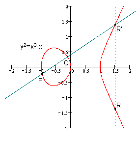   
   

法则详解：
▲这里的+不是实数中普通的加法，而是从普通加法中抽象出来的加法，他具备普通加法的一些性质，但具体的运算法则显然与普通加法不同。

▲根据这个法则，可以知道椭圆曲线无穷远点O∞与椭圆曲线上一点P的连线交于P’，过P’作y轴的平行线交于P，所以有 无穷远点 O∞+ P = P 。这样，无穷远点 O∞的作用与普通加法中零的作用相当（0+2=2），我们把无穷远点 O∞ 称为 零元。同时我们把P’称为P的负元（简称，负P；记作，-P）。（参见下图）

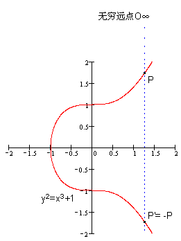  

▲根据这个法则，可以得到如下结论 ：如果椭圆曲线上的三个点A、B、C，处于同一条直线上，那么他们的和等于零元，即A+B+C= O∞

▲k个相同的点P相加，我们记作kP。如下图：P+P+P = 2P+P = 3P。

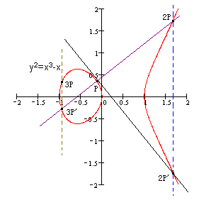  

下面，我们利用P、Q点的坐标(x1,y1)，(x2,y2)，求出R=P+Q的坐标(x4,y4)。

例4.1：求椭圆曲线方程y2+a1xy+a3y=x3+a2x2+a4x+a6上，平常点P(x1,y1)，Q(x2,y2)的和R(x4,y4)的坐标。
解：（1）先求点-R(x3,y3)
因为P,Q,-R三点共线，故设共线方程为y=kx+b,其中
若P≠Q(P,Q两点不重合) 则
直线斜率k=(y1-y2)/(x1-x2)
若P=Q(P,Q两点重合) 则直线为椭圆曲线的切线，故由例3.1可知：
k=(3x2+2a2x+a4 -a1y) /(2y+a1x+a3)

因此P,Q,-R三点的坐标值就是方程组：
y2+a1xy+a3y=x3+a2x2+a4x+a6 -----------------[1] 
y=(kx+b) -----------------[2]
的解。

将[2]，代入[1] 有
(kx+b)2+a1x(kx+b)+a3(kx+b) =x3+a2x2+a4x+a6 --------[3]
对[3]化为一般方程，根据三次方程根与系数关系（当三次项系数为1时；-x1x2x3 等于常数项系数， x1x2+x2x3+x3x1等于一次项系数，-(x1+x2+x3)等于二次项系数。）
所以-(x1+x2+x3)=a2-ka1-k2
x3=k2+ka1+a2+x1+x2;---------------------求出点-R的横坐标
因为k=(y1-y3)/(x1-x3) 故
y3=y1-k(x1-x3);-------------------------------求出点-R的纵坐标

（2）利用-R求R
显然有 x4=x3= k2+ka1+a2+x1+x2; ------------求出点R的横坐标
而y3 y4 为 x=x4时 方程y2+a1xy+a3y=x3+a2x2+a4x+a6的解
化为一般方程y2+(a1x+a3)y-(x3+a2x2+a4x+a6)=0 , 根据二次方程根与系数关系得：
-(a1x+a3)=y3+y4
故y4=-y3-(a1x+a3)=k(x1-x4)-y1-(a1x4+a3); ---------------求出点R的纵坐标
即：
x4=k2+ka1+a2+x1+x2;
y4=k(x1-x4)-y1-a1x4-a3;

本节的最后，提醒大家注意一点，以前提供的图像可能会给大家产生一种错觉，即椭圆曲线是关于x轴对称的。事实上，椭圆曲线并不一定关于x轴对称。如下图的y2-xy=x3+1
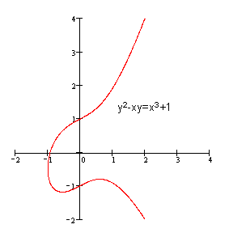  

五、密码学中的椭圆曲线

我们现在基本上对椭圆曲线有了初步的认识，这是值得高兴的。但请大家注意，前面学到的椭圆曲线是连续的，并不适合用于加密；所以，我们必须把椭圆曲线变成离散的点。
让我们想一想，为什么椭圆曲线为什么连续？是因为椭圆曲线上点的坐标，是实数的（也就是说前面讲到的椭圆曲线是定义在实数域上的），实数是连续的，导致了曲线的连续。因此，我们要把椭圆曲线定义在有限域上（顾名思义，有限域是一种只有由有限个元素组成的域）。

☆☆☆☆☆☆☆☆☆☆☆☆☆☆☆☆☆☆☆☆☆☆☆☆☆☆☆☆☆☆☆☆
域的概念是从我们的有理数，实数的运算中抽象出来的，严格的定义请参考近世代数方面的数。简单的说，域中的元素同有理数一样，有自己得加法、乘法、除法、单位元(1)，零元(0),并满足交换率、分配率。
☆☆☆☆☆☆☆☆☆☆☆☆☆☆☆☆☆☆☆☆☆☆☆☆☆☆☆☆☆☆☆☆

下面，我们给出一个有限域Fp，这个域只有有限个元素。

Fp中只有p（p为素数）个元素0,1,2 …… p-2,p-1；
Fp 的加法（a+b）法则是 a+b≡c (mod p)；即，(a+c)÷p的余数 和c÷p的余数相同。
Fp 的乘法(a×b)法则是 a×b≡c (mod p)；
Fp 的除法(a÷b)法则是 a/b≡c (mod p)；即 a×b-1≡c (mod p)；（b-1也是一个0到p-1之间的整数，但满足b×b-1≡1 (mod p)；具体求法可以参考初等数论，或我的另一篇文章）。
Fp 的单位元是1，零元是 0。

同时，并不是所有的椭圆曲线都适合加密。y2=x3+ax+b是一类可以用来加密的椭圆曲线，也是最为简单的一类。下面我们就把y2=x3+ax+b 这条曲线定义在Fp上：

选择两个满足下列条件的小于p(p为素数)的非负整数a、b
4a3+27b2≠0　(mod p)
则满足下列方程的所有点(x,y)，再加上 无穷远点O∞ ，构成一条椭圆曲线。
y2=x3+ax+b (mod p)
其中 x,y属于0到p-1间的整数，并将这条椭圆曲线记为Ep(a,b)。

我们看一下y2=x3+x+1 (mod 23)的图像

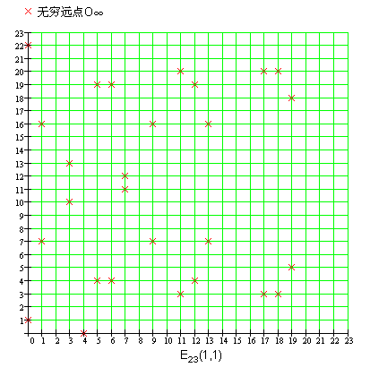

是不是觉得不可思议？椭圆曲线，怎么变成了这般模样，成了一个一个离散的点？
椭圆曲线在不同的数域中会呈现出不同的样子，但其本质仍是一条椭圆曲线。举一个不太恰当的例子，好比是水，在常温下，是液体；到了零下，水就变成冰，成了固体；而温度上升到一百度，水又变成了水蒸气。但其本质仍是H2O。

Fp上的椭圆曲线同样有加法，但已经不能给以几何意义的解释。不过，加法法则和实数域上的差不多，请读者自行对比。

1 无穷远点 O∞是零元，有O∞+ O∞= O∞，O∞+P=P
2 P(x,y)的负元是 (x,-y)，有P+(-P)= O∞
3 P(x1,y1),Q(x2,y2)的和R(x3,y3) 有如下关系：
x3≡k2-x1-x2(mod p) 
y3≡k(x1-x3)-y1(mod p)
其中若P=Q 则 k=(3x2+a)/2y1 若P≠Q，则k=(y2-y1)/(x2-x1)

例5.1 已知E23(1,1)上两点P(3,10)，Q(9,7)，求1)-P，2)P+Q，3) 2P。
解 1) –P的值为(3,-10)
2) k=(7-10)/(9-3)=-1/2，2的乘法逆元为12 因为2*12≡1 (mod 23)
k≡-1*12 (mod 23) 故 k=11。
x=112-3-9=109≡17 (mod 23);
y=11[3-(-6)]-10=89≡20 (mod 23)
故P+Q的坐标为(17,20)
3) k=[3(32)+1]/(2*10)=1/4≡6 (mod 23)
x=62-3-3=30≡20 (mod 23)
y=6(3-7)-10=-34≡12 (mod 23)
故2P的坐标为(7,12)

最后，我们讲一下椭圆曲线上的点的阶。
如果椭圆曲线上一点P，存在最小的正整数n，使得数乘nP=O∞，则将n称为P的 阶，若n不存在，我们说P是无限阶的。
事实上，在有限域上定义的椭圆曲线上所有的点的阶n都是存在的（证明，请参考近世代数方面的书）

练习：
1 求出E11(1,6)上所有的点。
2 已知E11(1,6)上一点G(2,7)，求2G到13G所有的值。

六、椭圆曲线上简单的加密/解密

公开密钥算法总是要基于一个数学上的难题。比如RSA 依据的是：给定两个素数p、q 很容易相乘得到n，而对n进行因式分解却相对困难。那椭圆曲线上有什么难题呢？

考虑如下等式：
K=kG [其中 K,G为Ep(a,b)上的点，k为小于n（n是点G的阶）的整数]
不难发现，给定k和G，根据加法法则，计算K很容易；但给定K和G，求k就相对困难了。
这就是椭圆曲线加密算法采用的难题。我们把点G称为基点（base point），k（k
现在我们描述一个利用椭圆曲线进行加密通信的过程：

1、用户A选定一条椭圆曲线Ep(a,b)，并取椭圆曲线上一点，作为基点G。
2、用户A选择一个私有密钥k，并生成公开密钥K=kG。
3、用户A将Ep(a,b)和点K，G传给用户B。
4、用户B接到信息后 ，将待传输的明文编码到Ep(a,b)上一点M（编码方法很多，这里不作讨论），并产生一个随机整数r（r
5、用户B计算点C1=M+rK；C2=rG。
6、用户B将C1、C2传给用户A。
7、用户A接到信息后，计算C1-kC2，结果就是点M。因为
C1-kC2=M+rK-k(rG)=M+rK-r(kG)=M
再对点M进行解码就可以得到明文。

在这个加密通信中，如果有一个偷窥者H ，他只能看到Ep(a,b)、K、G、C1、C2 而通过K、G 求k 或通过C2、G求r 都是相对困难的。因此，H无法得到A、B间传送的明文信息。

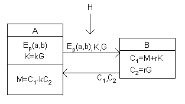

密码学中，描述一条Fp上的椭圆曲线，常用到六个参量：
T=(p,a,b,G,n,h)。
（p 、a 、b 用来确定一条椭圆曲线，
G为基点，
n为点G的阶， 
h 是椭圆曲线上所有点的个数m与n相除的整数部分）

这几个参量取值的选择，直接影响了加密的安全性。参量值一般要求满足以下几个条件：

1、p 当然越大越安全，但越大，计算速度会变慢，200位左右可以满足一般安全要求；
2、p≠n×h；
3、pt≠1 (mod n)，1≤t<20；
4、4a3+27b2≠0 (mod p)；
5、n 为素数；
6、h≤4。

七、椭圆曲线在软件注册保护的应用

我们知道将公开密钥算法作为软件注册算法的好处是Cracker很难通过跟踪验证算法得到注册机。下面，将简介一种利用Fp(a,b)椭圆曲线进行软件注册的方法。

软件作者按如下方法制作注册机（也可称为签名过程）

1、选择一条椭圆曲线Ep(a,b)，和基点G；
2、选择私有密钥k（k
3、产生一个随机整数r（r
4、将用户名和点R的坐标值x,y作为参数，计算SHA（Secure Hash Algorithm 安全散列算法，类似于MD5）值，即Hash=SHA(username,x,y)；
5、计算sn≡r - Hash * k (mod n)
6、将sn和Hash作为 用户名username的序列号

软件验证过程如下：（软件中存有椭圆曲线Ep(a,b)，和基点G，公开密钥K）

1、从用户输入的序列号中，提取sn以及Hash；
2、计算点R≡sn*G+Hash*K ( mod p )，如果sn、Hash正确，其值等于软件作者签名过程中点R(x,y)的坐标，因为
sn≡r-Hash*k （mod n）
所以
sn*G + Hash*K
=(r-Hash*k)*G+Hash*K
=rG-Hash*kG+Hash*K
=rG- Hash*K+ Hash*K
=rG=R ；
3、将用户名和点R的坐标值x,y作为参数，计算H=SHA(username,x,y)；
4、如果H=Hash 则注册成功。如果H≠Hash ，则注册失败(为什么？提示注意点R与Hash的关联性)。

简单对比一下两个过程：
作者签名用到了：椭圆曲线Ep(a,b)，基点G，私有密钥k，及随机数r。
软件验证用到了：椭圆曲线Ep(a,b)，基点G，公开密钥K。
Cracker要想制作注册机，只能通过软件中的Ep(a,b)，点G，公开密钥K ，并利用K=kG这个关系获得k后，才可以。而求k是很困难的。

练习：
下面也是一种常于软件保护的注册算法，请认真阅读，并试回答签名过程与验证过程都用到了那些参数，Cracker想制作注册机，应该如何做。

软件作者按如下方法制作注册机（也可称为签名过程）
1、选择一条椭圆曲线Ep(a,b)，和基点G；
2、选择私有密钥k（k
3、产生一个随机整数r（r
4、将用户名作为参数，计算Hash=SHA(username)；
5、计算 x’=x (mod n)
6、计算sn≡(Hash+x’*k)/r (mod n)
7、将sn和x’作为 用户名username的序列号

软件验证过程如下：(软件中存有椭圆曲线Ep(a,b)，和基点G，公开密钥K)
1、从用户输入的序列号中，提取sn以及x’；
2、将用户名作为参数，计算Hash=SHA(username)；
3、计算 R=(Hash*G+x’*K)/sn，如果sn、Hash正确,其值等于软件作者签名过程中点R(x,y)，因为
sn≡(Hash+x’*k)/r (mod n)
所以
(Hash*G+x’*K)/sn
=(Hash*G+x’*K)/[(Hash+x’*k)/r]
=(Hash*G+x’*K)/[(Hash*G+x’*k*G)/(rG)]
=rG*[(Hash*G+x’*K)/(Hash*G+x’*K)]
=rG=R (mod p)
4、v≡x (mod n)
5、如果v=x’ 则注册成功。如果v≠x’ ，则注册失败。
</N），计算点R(X,Y)=RG； /></N），利用基点G计算公开密钥K=KG； />

八、结语

历经半个多月断断续续的写作，这篇拙作终于算告一段落了。为写这篇文章，我查了大量的资料，但为了使文章更通俗易懂，我尽量避免涉及专业术语，F2n 域上的椭圆曲线本文也没有涉及。不过，一些名词描述的可能还不太精确，希望众读者对文章的问题，多多批评指正。我也仅仅把这篇文章作为初稿，我会不断修订他的。最后感谢看雪、Sunbird、CCG以及看雪论坛所有成员对我的支持，感谢一切帮助过我的人，没有你们的鼓励，这篇文章我是没有动力写完的，谢谢，谢谢大家！

2003-5- 3 初稿，于看雪论坛
2004-7-11二稿，修正一张图片

<全文完>

主要参考文献

张禾瑞，《近世代数基础》，高等教育出版社，1978
闵嗣鹤 严士健，《初等数论》，高等教育出版社，1982
段云所，《网络信息安全》第三讲，北大计算机系
Michael Rosing ，chapter5《Implementing Elliptic Curve Cryptography》，Softbound，1998
《SEC 1: Elliptic Curve Cryptography》，Certicom Corp.，2000
《IEEE P1363a / D9》，2001